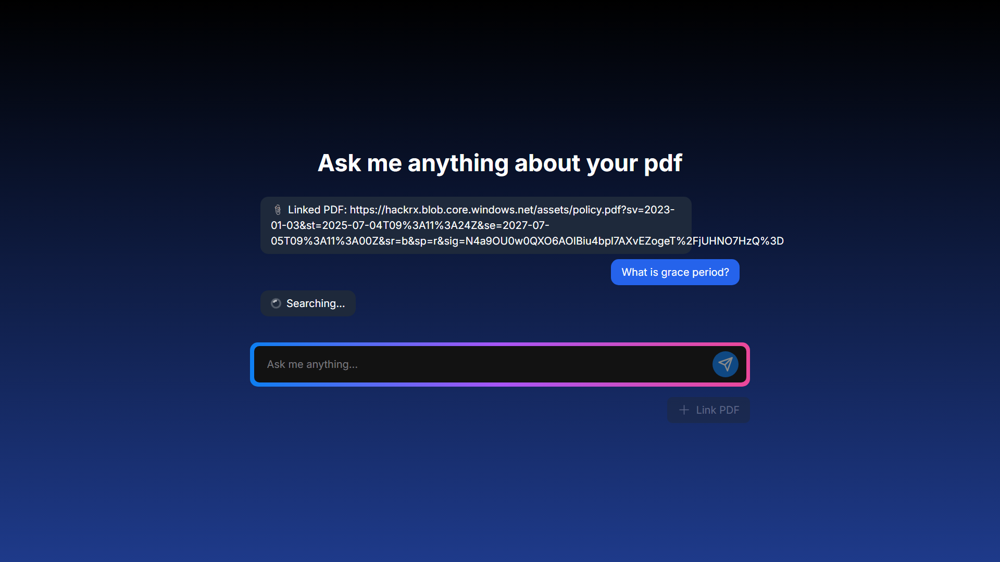
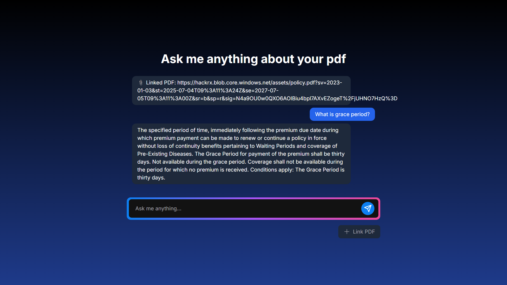

# 📄 PDF Chatbot – Search Answers from PDFs

## 🧠 Overview
This project is a **Chatbot** that can **search a PDF** and return **accurate answers** to any user query.  
It processes the document, understands the context, and gives concise, relevant responses.  

---

## 🚀 Features
- 📂 Upload any PDF document.
- 🔍 Ask questions in natural language.
- 🤖 AI-powered search to find the exact answers from your document.
- ⚡ Fast and accurate results.

---

## 📸 Screenshots

### 1️⃣ Landing Page


### 2️⃣ Thinking...


### 3️⃣ Final Output


---

## 🛠️ Installation & Usage

### 1. Clone the repository
```bash
git clone https://github.com/your-username/your-repo-name.git
cd your-repo-name
